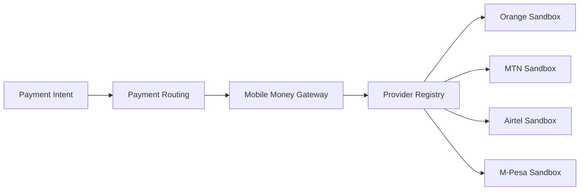

# Mobile Money Gateway Architecture

## Context

The gateway is an execution boundary between Payment Routing and provider-specific
Mobile Money connectors. It accepts a selected provider and normalized payment
request, validates provider capabilities, and delegates execution through
`IMobileMoneyProvider`.

## Components

- `MobileMoney.Domain` owns provider definitions, payment state, statuses, and
  domain errors.
- `MobileMoney.Application` owns the provider-neutral contract, registry,
  idempotent gateway, audit events, and operational telemetry.
- `MobileMoney.Api` composes sandbox providers and exposes HTTP endpoints.
- `MobileMoney.Scenarios` validates the provider-neutral behavior without real
  operator connectivity.

## Provider registry

Provider codes are resolved case-insensitively. Duplicate codes fail during
composition so routing cannot select an ambiguous connector. Country and currency
capabilities are declared by each provider definition and enforced before any
provider call.

## State and idempotency

AFW-DLV-0014.5 uses concurrent in-memory stores as a sandbox foundation. The
idempotency key is registered before provider execution, and concurrent duplicate
requests resolve to the same payment without invoking the provider twice.

Durable payment storage and distributed idempotency are production infrastructure
concerns and are not claimed by this delivery.

## Callback boundary

Callbacks are delegated to the selected provider adapter for external-status
translation. Production adapters must additionally verify operator signatures,
timestamps, replay controls, and provider-specific authenticity requirements
before returning a status to the gateway.

## Security boundary

This repository contains no operator credentials, OAuth secrets, API keys, or
production callback signing material. Production connectors must obtain those
values through approved secret infrastructure and must be delivered separately.