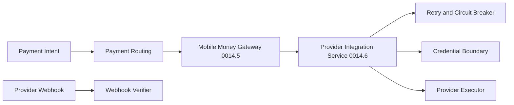

# ADR-0236 - Provider Integration Architecture

## Status

Accepted for AFW-DLV-0014.6.

## Context

Payment Routing selects a rail and provider. The Mobile Money Gateway executes a
provider-neutral payment flow. Provider-specific authentication, transport,
webhook verification, resilience, and operational health must not leak into
either owner.

## Decision

Introduce a Provider Integration platform with four layers:

- Domain defines environment, configuration, health, error, and webhook models.
- Application defines credentials, secrets, webhooks, health, execution, retry,
  circuit breaking, audit, and telemetry contracts.
- Infrastructure supplies environment-backed webhook secrets and sandbox
  implementations for credentials and execution.
- API composes the sandbox platform and exposes execution, health, webhook
  verification, audit, and telemetry endpoints.

## Consequences

- Provider-specific connectors can be added without changing routing or gateway
  ownership.
- Sandbox adapters can validate orchestration without claiming production
  certification.
- Production connectors must implement the same interfaces and supply their own
  authentication, transport, error mapping, and webhook policy.
- Current health and circuit state are process-local foundations, not distributed
  production state.